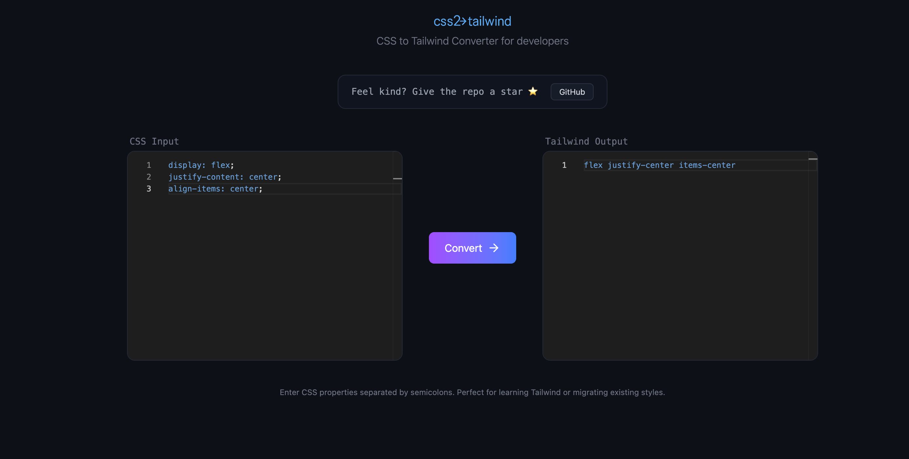
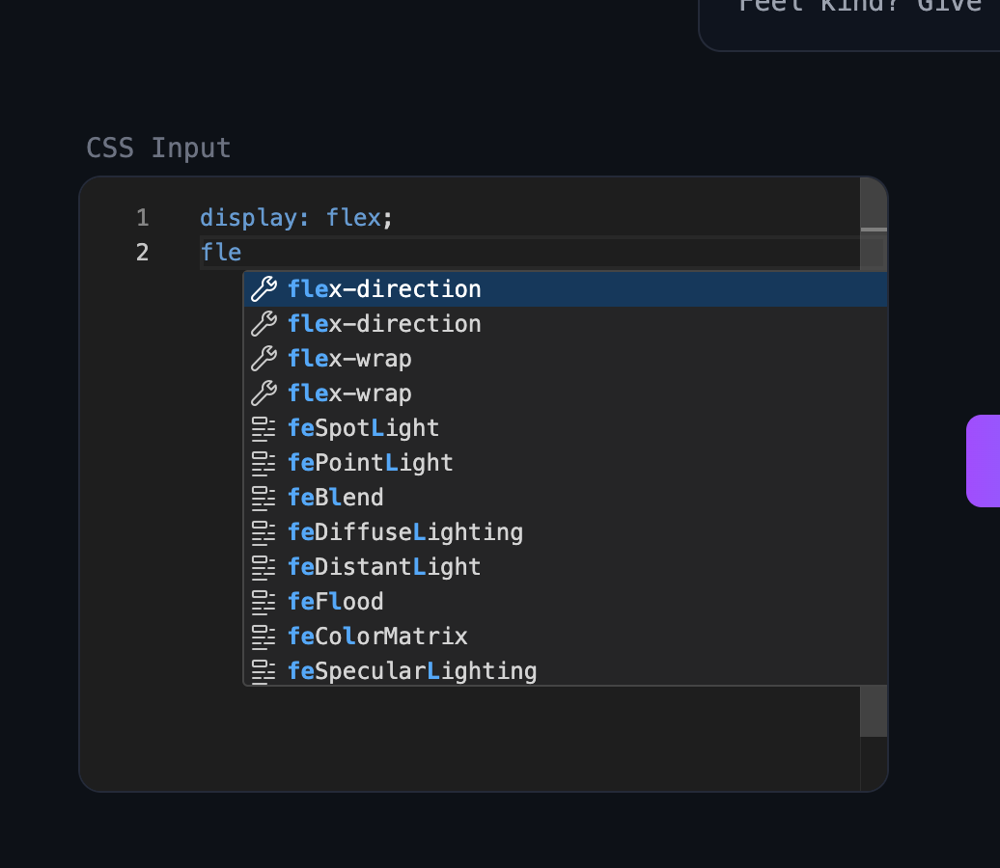

# CSS2TW 🚀

**CSS2TW** is a lightweight, developer-friendly tool that converts traditional CSS properties into Tailwind CSS utility classes.

It’s designed not only to speed up migrations, but also to **help developers learn Tailwind through real-time autocomplete and instant feedback**.

---

## ✨ Features

- 🔁 **CSS → Tailwind conversion**  
  Paste CSS properties and get the equivalent Tailwind utility classes.

- ⚡ **Smart autocomplete (learning-focused)**  
  As you type CSS, the editor suggests valid properties and values that map directly to Tailwind classes — perfect for learning Tailwind while you work.

- 🧠 **Learn by typing**  
  See how each CSS rule translates into Tailwind utilities in real time.

- 🎯 **Clean output**  
  Only valid Tailwind classes are returned. No noise.

- 🧩 **Built with Monaco Editor**  
  IDE-like experience directly in the browser.

---

## 🖼️ Preview

### CSS Input → Tailwind Output

### Autocomplete & Learning Experience

---

## 🧠 Why CSS2TW?

Tailwind is powerful, but the learning curve can be steep.

**CSS2TW bridges the gap** by letting you:
- Write familiar CSS
- Instantly see the Tailwind equivalent
- Learn utilities naturally through autocomplete

It’s especially useful for:
- Developers new to Tailwind
- Migrating legacy CSS codebases
- Understanding how Tailwind utilities map to CSS concepts

---

## 🛠️ Tech Stack

- **React**
- **Vite**
- **Tailwind CSS**
- **Monaco Editor**
- **Lucide Icons**

---

## ⭐ Show some support

If this project helped you learn Tailwind or saved you time,  
feel free to **give the repo a star ⭐** — it really helps!

---

## 📄 License

MIT — free to use, modify, and share.